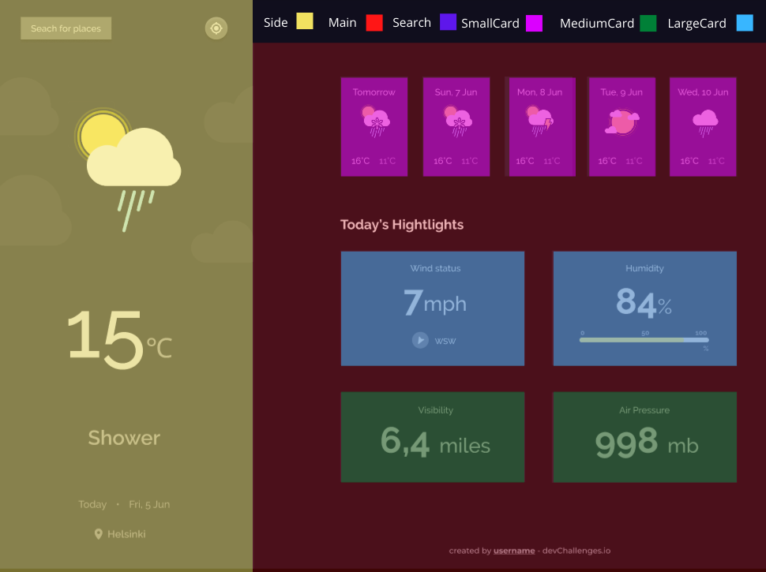
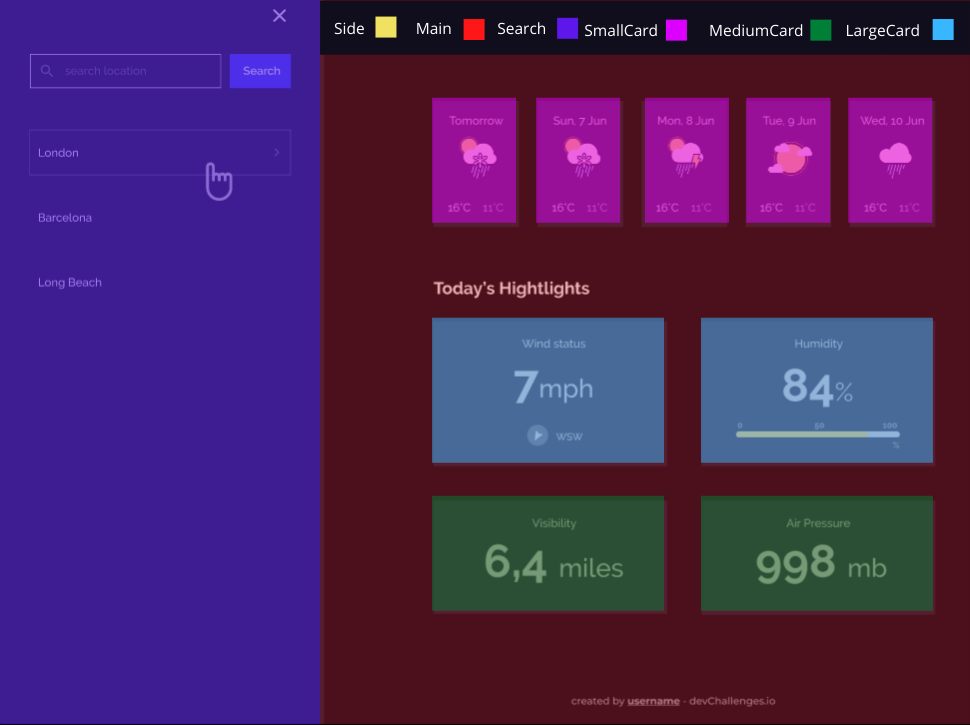

# Weather App

This is a challenge from Devchallenges. Developed with the following technologies listed bellow. The app was splited in small components and united in App: 

 

**Componets separated by colors**

 

# Features

**User Can:**

- see city weather as default
- search for city
- see weather of today and the next 5 days
- see the date and location of the weather
- see according to image for each type of weather
- see the min and max degree each day
- see wind status and wind direction
- see humidity percentage
- see a visibility indicator
- see the air pressure number
- request current location weather
- convert temperature in Celcius to Fahrenheit and vice versa

 

# Links

1 - [Github](https://github.com/Tiago-Rodrigs/weather)

2 - [Live demo](https://theweatherappp.netlify.app/)

3 - [Design](https://www.figma.com/file/5X3Ao3gEqZPqqKctP7riDF)

 

# Technologies used

- HTML
- CSS
- JAVASCRIPT
- REACT JS

 

# Acknowledgements

**APi:**

- [Meta Weather](https://https://www.metaweather.com/api/)
- [Font awesome](https://fontawesome.com/)
- [ Cors proxy ](https://github.com/Rob--W/cors-anywhere)
